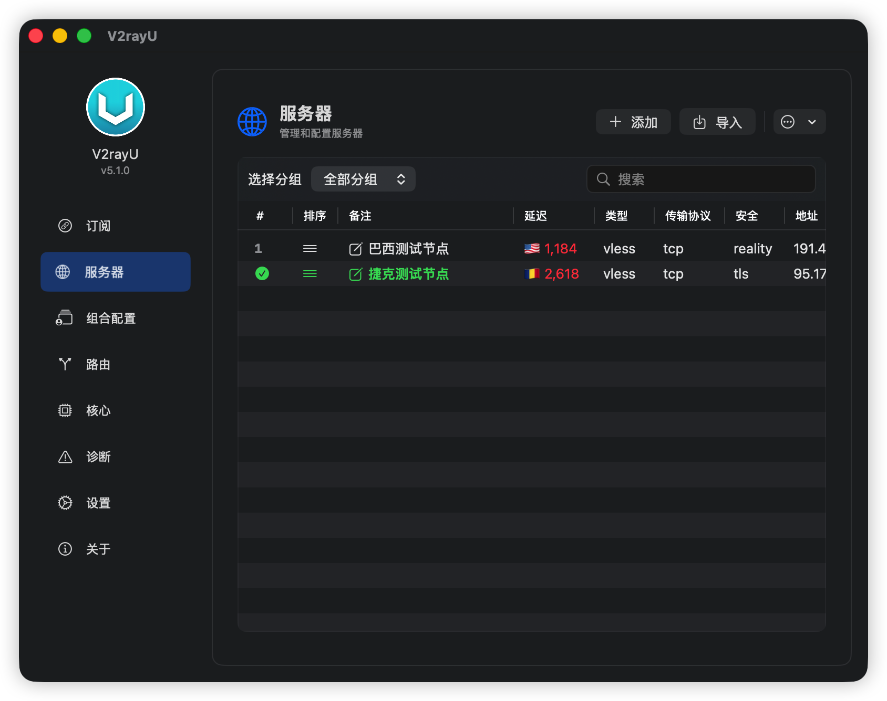
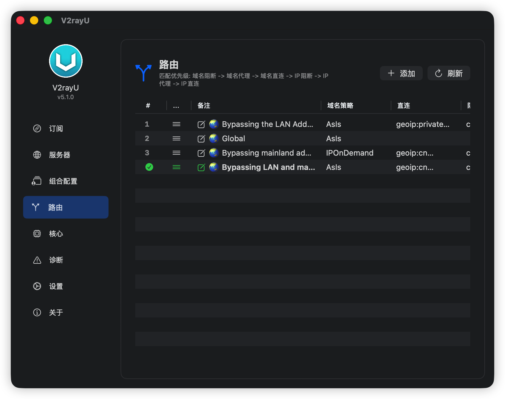
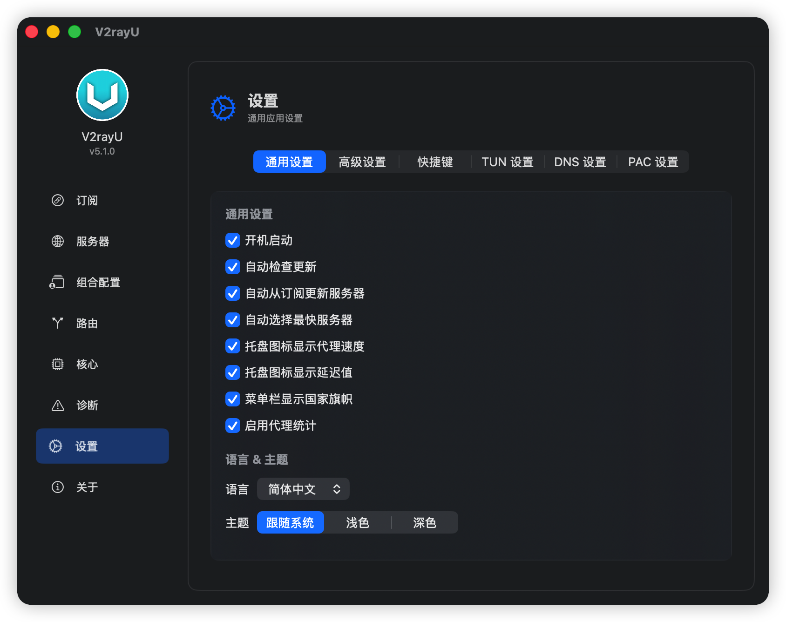
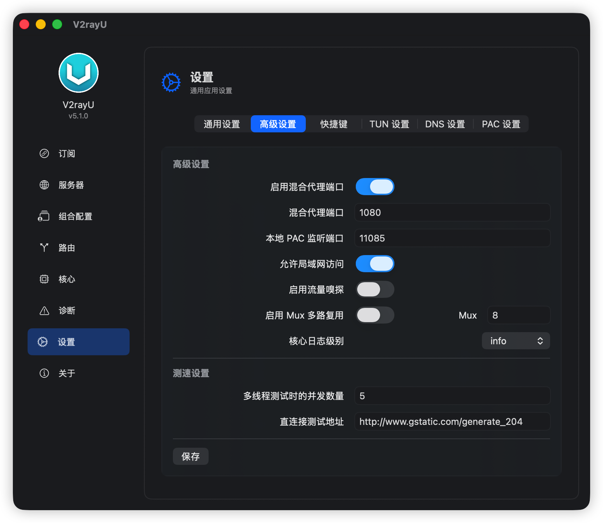
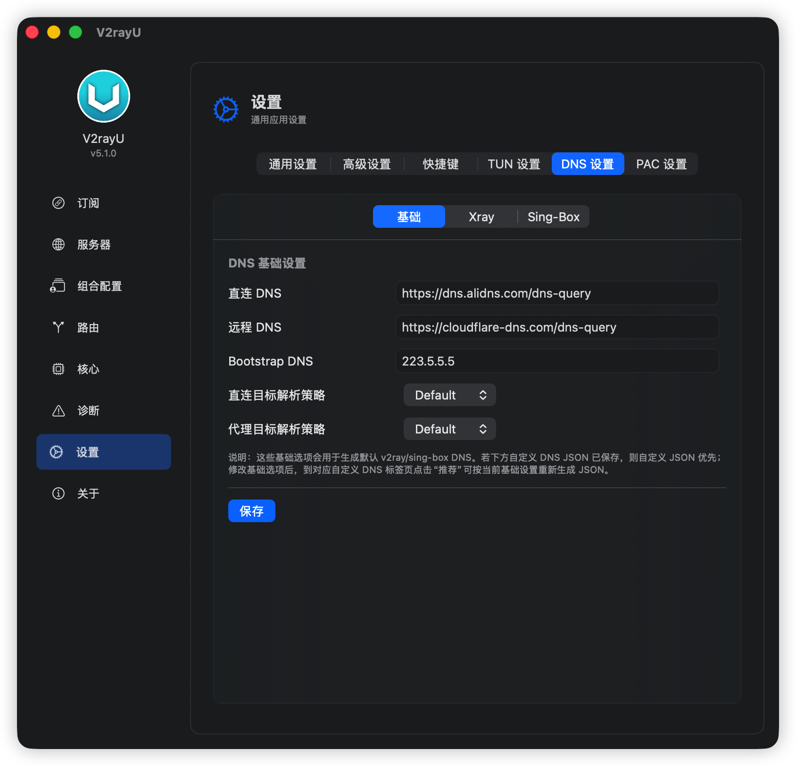
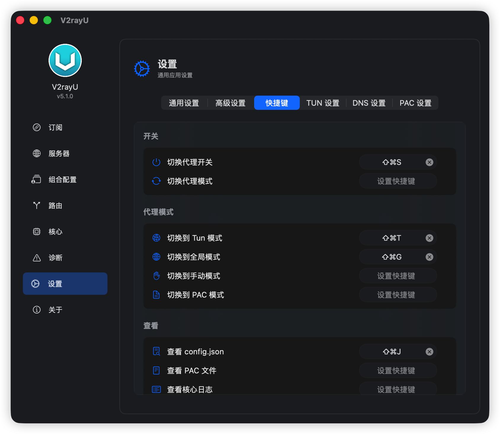

<picture><source media="(prefers-color-scheme: dark)" srcset="./V2rayU/Resources/Assets.xcassets/AppIcon.appiconset/128.png"></picture>

# V2rayU 

A macOS proxy client based on [Xray-core](https://github.com/XTLS/Xray-core) and [sing-box](https://github.com/SagerNet/sing-box), supporting multiple protocols including VMess, VLESS, Trojan, Shadowsocks, SSR, SSH, SOCKS5, Hysteria, Hysteria2, Tuic, AnyTLS, and Naive. Written in SwiftUI, supporting macOS 14+.

> For the legacy version (below 5.0) based on V2Ray-core, please check the [master](https://github.com/yanue/V2rayU/tree/master) branch.

---

## Features

- **Multi-Protocol Support** — VMess, VLESS, Trojan, Shadowsocks, SSR, SSH, SOCKS5, Hysteria, Hysteria2, Tuic, AnyTLS, Naive, etc.
- **Dual-Core Engine** — Intelligently selects between Xray-core and sing-box, automatically matching the most compatible core based on protocol, transport, and security configurations.
- **Run Modes** — PAC Mode, Global Proxy, Manual Proxy, and TUN Mode (virtual network interface global proxy).
- **Subscription Management** — Supports V2Ray, SS, and SSR subscriptions with automatic update capabilities.
- **Import Methods** — Scan QR code from screen, import from pasteboard, import from local files, or import via URLs.
- **Routing Rules** — Built-in common routing rule groups with custom rules support.
- **Combinations & Load Balancing** — Group multiple servers and balance loads across them.
- **Compatibility Rules Engine** — Automatically detects core version capabilities for each protocol and transport method.
- **Latency Testing** — Built-in Ping and HTTP latency testing.
- **Diagnostic Tools** — Built-in network diagnostics.
- **Auto Update** — Supports automatic updates for both the application and the cores.
- **Localization** — Simplified Chinese (简体中文), Traditional Chinese (繁體中文), and English.

## Installation

Download the latest DMG installation package from [Releases](https://github.com/yanue/V2rayU/releases).

## Preview

<p>
  
</p>
<p>
  
  
  
</p>
<p>
  
  
  
</p>
<p>
  
  
  
</p>
<p>
  
  
  
</p>
<p>
  
</p>

## Run Modes

| Mode | Description |
|------|------|
| **Global** | Configures system HTTP/HTTPS/SOCKS proxy settings to the local proxy port. |
| **PAC** | Automated proxy based on PAC rules, dynamically determining whether to bypass or proxy traffic. |
| **Manual** | Manual mode, suitable for use with browser extensions (e.g., SwitchyOmega). |
| **TUN** | Virtual network adapter level global proxy, forwarding all traffic through sing-box. |

## Core Engines

V2rayU automatically chooses the best core according to configuration:

- **Xray-core** — Mature proxy core with rich protocol and transport method support.
- **sing-box** — Universal proxy platform supporting TUN mode, SSH, Hysteria, Hysteria2, Tuic, AnyTLS, Naive, etc.

Through the built-in compatibility rules engine ([CoreCapabilityRules](./V2rayU/Core/Utilities/CoreCapabilityRules.swift)), it checks the support of each protocol, transport method, and security configuration for the active core version, displaying a warning if any incompatibilities are found.

## Paths & Locations

| Path | Description |
|------|------|
| `~/.V2rayU/V2rayU.log` | Application logs |
| `~/.V2rayU/core.log` | Core engine output/error logs |
| `~/.V2rayU/tun.log` | TUN mode helper logs |
| `~/.V2rayU/config.json` | Active core configuration file |
| `~/.V2rayU/tun.json` | TUN mode configuration file |
| `~/.V2rayU/.V2rayU.db` | SQLite database (using GRDB) |
| `~/Library/LaunchAgents/yanue.v2rayu.xray-core.plist` | Xray-core LaunchAgent |
| `~/Library/LaunchAgents/yanue.v2rayu.sing-box.plist` | sing-box LaunchAgent |
| `/Library/LaunchDaemons/yanue.v2rayu.tun-helper.plist` | TUN helper system LaunchDaemon |
| `/usr/local/v2rayu/` | Directory for core binaries and setuid helpers |

## Build

```bash
git clone https://github.com/yanue/V2rayU.git
cd V2rayU

# Build universal binaries and package DMG
./Build/build.sh
```

Requirements: Xcode 15+ and macOS 14+ SDK.

## Testing

```bash
# Run unit tests
xcodebuild test -project V2rayU.xcodeproj -scheme V2rayU -destination 'platform=macOS'

# Run compatibility test suite
./Build/tests/run-compatibility-test.sh --download
```

## Tech Stack

- **Language**: Swift 5+
- **UI Framework**: SwiftUI + AppKit (for menu bar integration)
- **Database**: GRDB (SQLite)
- **Local PAC Server**: FlyingFox (HTTP)
- **Dependency Management**: Swift Package Manager
- **Analytics & Crash Reporting**: Firebase / AppCenter

## Contribution

Issues and Pull Requests are welcome. Please read [AGENTS.md](./AGENTS.md) for project structure details and development guidelines.

## License

[GPLv3](./LICENSE)

## Acknowledgements

- Logo Design: @小文
- Special thanks to opencode
